# 🧠 The Training Process: How Tabsirah Learns

This guide explains exactly how we turn raw images into a smart AI model.

---

## 🔄 The Pipeline Overview

The process happens in two main stages:
1.  **Processing**: Turning images into numbers (Landmarks).
2.  **Training**: Teaching the computer to recognize patterns in those numbers.

```mermaid
graph LR
    A[📷 Images] -->|src/3_process_data.py| B(📍 21 Landmarks)
    B -->|Normalization| C(🔢 42 Numbers)
    C -->|src/4_train_model.py| D[🧠 Random Forest Model]
    D --> E[✅ Prediction]
```



---

## 1. Data Processing (`src/3_process_data.py`)

**Goal:** The AI cannot understand pixels (colors). It only understands geometry (shapes). We need to extract the "shape" of the hand.

### Step A: Hand Detection (MediaPipe)
We use a tool from Google called **MediaPipe**. It scans the image and finds 21 specific points on the hand:
*   Points 0-4: Thumb
*   Points 5-8: Index Finger
*   ...and so on.

### Step B: Feature Extraction
For every single image, we save the `x` and `y` coordinates of these 21 points.
*   21 points × 2 coordinates (x, y) = **42 Features** total.

### Step C: Normalization (Crucial!)
*   **Problem:** If you move your hand closer to the camera, the hand looks bigger, and the coordinates change. The AI gets confused.
*   **Solution**: We make the hand coordinates "relative" to the wrist (Point 0) or the bounding box.
    *   *Formula:* `New_X = Point_X - Min_X`
    *   This forces every hand to start at (0,0), regardless of where it is in the camera.

**Output:** A file called `data_processed/data_arabic.pickle`.
*   It's just a big list of numbers. No images are saved here.

---

## 2. Model Training (`src/4_train_model.py`)

**Goal:** Teach the computer to look at those 42 numbers and guess the letter.

### The Algorithm: Random Forest 🌳
We use an algorithm called **Random Forest**. Imagine asking 200 people to guess the sign.
*   **Decision Trees**: The "Forest" is made of 200 "Trees".
*   **Voting**: Each tree makes a guess. The majority vote wins.
    *   *Example:* 150 trees say "Alif", 50 say "Ba". The model output is "Alif".

### Step A: Splitting the Data
*   **80% Training Data**: Used to teach the model.
*   **20% Testing Data**: Hidden from the model. Used to give it a "Final Exam" to check accuracy.

### Step B: The Results
Our model consistently achieves **98-99% Accuracy**.
*   It is very fast (< 0.05 seconds per guess).
*   It is lightweight (runs easily on any laptop).

**Output:** A file called `models/model_arabic.p`.
*   This is the "Brain" file that `app.py` loads to work.

---

## 🧪 Summary Table

| Step | Script | Input | Output |
| :--- | :--- | :--- | :--- |
| **1. Process** | `src/3_process_data.py` | Images (`.jpg`) | `data_arabic.pickle` (Numbers) |
| **2. Train** | `src/4_train_model.py` | `data_arabic.pickle` | `model_arabic.p` (The Brain) |

---

## 🚀 How to Run It Yourself

If you added new photos and want to retrain:

```bash
# 1. Process the new images
python src/3_process_data.py

# 2. Train the model
python src/4_train_model.py
```
